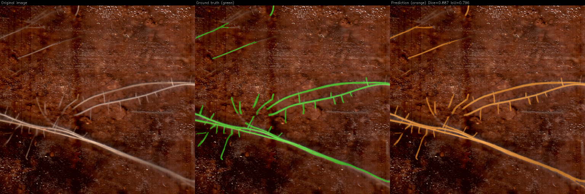

# Fine-tuning SAM 2 for root segmentation in soil images

Adapting and fine-tuning Meta's SAM 2 to segment roots in soil cross-section images, 
with an evaluation against a U-Net++ baseline and against the model the client was 
using at the time.

Carried out with [Humeos](https://humeos.com) as part of a first-year engineering project at CentraleSupélec (January-June 2026). Humeos develops non-destructive sensors that analyse soil biological activity in real time; segmenting roots is the first step of that analysis.

 

## Quick start

```bash
git clone https://github.com/facebookresearch/sam2   #into ./sam2 
pip install -e ./sam2
#download sam2.1_hiera_tiny.pt into sam2/checkpoints/
cp configs/sam2.1_hiera_t_custom_soil.yaml sam2/sam2/configs/sam2.1_training/
pip install -r requirements.txt

python sam2_pipeline.py prepare --tiles_dir <images> --masks_dir <masks>
python sam2_pipeline.py train
python sam2_pipeline.py eval  --checkpoint <ckpt>
python sam2_pipeline.py viz   --checkpoint <ckpt> --num_samples 5
python sam2_pipeline.py hist  --checkpoint <ckpt> --metric dice

```

Paths can also be set through environment variables rather than flags - run `python config.py` to print the effective configuration.

Expected data: 1024x1024 RGB images (`.png` or `.jpg`) in one folder, and binary `.png` masks with the same file names in another.

The training configuration in `configs/` is the one saved by the SAM 2 trainer for the reported run. Training from a clean clone has not been re-run since, as the GPU node is no longer available.

## The problem

796 pairs of 1024x1024 RGB images and masks, annotated semi-automatically by the client.

Roots cover **1.85 % of the pixels on average** (std 2.60 %, from 0 % to 24 %).
That imbalance rules out accuracy as a metric - a model predicting "background" everywhere would score 98 % - and rules out plain cross-entropy as a loss.

The images are proprietary and are **not** distributed here.

## Method

### Why SAM 2

SAM 2 is a foundation model built on a Vision Transformer and trained on over a billion masks. It has three blocks: an image encoder, a prompt encoder (a point, a box, or nothing) and a mask decoder that combines the two through cross attention. Unlike a U-Net it is *promptable*, and in principle it segments zero-shot.

A systematic comparison across nine root datasets published the same year (Smith et al., 2026) also reported that Transformer architectures outperform ConvNets on this task - with the caveat, which turned out to matter here, that the choice of dataset explains far more performance variance (70.9 %) than the choice of architecture (6.7 %).

### Zero-shot does not work here

Run as-is, SAM 2 reaches a median Dice of 0.012 with a point at the centroid of the root pixels, and 0.050 with an exact bounding box around the roots. The pre-trained model does follow the prompt, but even a box that delimits the target leaves it far off. Its failure mode is telling: median recall is high (0.82 with the box) while precision is near zero (0.03) - the model covers the roots but segments a large surrounding region of soil. The images in SA-1B look nothing like ours: roots are thin, branching structures buried in the visual noise of soil, not the compact objects the model was trained to isolate. Fine-tuning was therefore necessary.

### Adapting still images to a video framework

SAM2 extends SAM to video, and its training framework consumes VOS-style sequences rather than single images: a video is a folder of numbered frames, with one sub-folder of masks per tracked object. `prepare_data` stores each image as a one-frame sequence, without modifying the pixels, and the training configuration samples a single frame and a single object (`num_frames: 1`, `max_num_objects: 1`):

```
prepared_data/
    images/image_000001/00000.jpg
    masks/image_000001/0/00000.png
    train_list.txt  557 images
    val_list.txt    119 images
    test_list.txt   120 images
```

Masks are converted to grayscale, as required by SAM 2's `vos_dataset.py`.

### Training

SAM 2.1 Hiera-tiny, fine-tuned for 50 epochs over the 557 training images (27 850 steps at batch size 1, on a single GPU of a DGX node, about 4 hours). The training run reports `steps: {'train': 27850, 'val': 0}` - no validation pass was ever executed, so no model selection took place on the validation set. That matters for reading the results below.

### Metrics

Following Maier-Hein et al., *Metrics reloaded* (2024):

- **Dice** - pixel overlap.
- **clDice** - Dice computed on the skeletons, so it rewards topological continuity rather than raw overlap. Suited to tubular structures. 
- **NSD** (Normalized Surface Distance) - boundary accuracy within a tolerance, the most demanding of the three on thin contours. 

## Results

The deliverable was a recommendation for the client, whose existing model reached 0.111 Dice. SAM 2 was evaluated with a point prompt at the centroid of the root pixels, U-Net++ from the image alone. 

A control experiment changes how the SAM 2 figures should be read. A point fixed at the image centre, carrying no information about the roots, gives the same median Dice as the centroid point (0.764), and an exact bounding box only raises it to 0.778. Because every training image had a single target - all roots - the prompt never changed the expected answer during fine-tuning, and the model learned to rely on the image alone. The fine-tuned SAM 2 therefore behaves essentially as an automatic method, like U-Net++.

Before fine-tuning, the same box raises the median Dice fourfold; after, it barely matters.

| Median | SAM 2 fine-tuned (val, n=119) | U-Net++ (test, n=120) |
|---|---|---|
| Dice | 0.764 | 0.781 |
| clDice | 0.858 | 0.840 |
| NSD | 0.659 | 0.827 |

*The two models are evaluated on different images - see Known limitations.*

Dice and clDice are close enough that neither model shows a clear advantage on overlap and topology. The NSD gap is larger: U-Net++ is markedly better at boundary precision. Combined with its much lower inference cost, that is what settled the project's recommendation in favour of U-Net++ for field deployment. 

## Known limitations

- **Prompt sensitivity.** The point prompt is placed at the centroid of the root pixels, which falls on soil in 102 of 119 validation images. As shown in Results, the fine-tuned model relies little on the prompt, so this protocol does not measure a prompt-guided use of SAM 2. 
- **Different data splits.** The U-Net++ branch used scikit-learn's `train_test_split`; this pipeline reimplements the same 70/15/15 split with NumPy, which draws different images. The two models were therefore evaluated on different images, so small gaps should not be over-interpreted.
- **Annotation quality.** About ten images per metric score exactly zero. Inspecting them showed blurred acquisitions or damaged ground-truth masks rather than model failures; they pull the means down independently of the model. On this dataset, improving the annotations would likely buy more than changing the architecture - which is also what Smith et al. report at a larger scale.
- **One model size.** Only Hiera-tiny was fine-tuned, for compute reasons. 

## Repository layout

| File | Contents |
|---|---|
|`config.py`|paths and split parameters, overridable by environment variable |
| `sam2_pipeline.py` | data preparation, fine-tuning, evaluation, visualisation |
| `check_centroids.py` | counts how often the centroid prompt falls on soil |
| `configs/sam2.1_hiera_t_custom_soil.yaml`| SAM 2 training configuration |
| `requirements.txt`|dependencies |

## Authorship and permissions

The SAM 2 branch of this project was carried out jointly by **Alexandre Fakih** and **Alexandre Bienvenüe**, and is the only part published here. The U-Net++ figures quoted above come from the parallel branch of the same project, developed by other members of the project.

The code, the reported metrics and the illustration images are published with the explicit permission of Humeos. The image database itself remains proprietary and is not distributed.

## References

[1] Ravi et al., *SAM 2: Segment Anything in Images and Videos*,  2024  
[2] Smith et al., *A systematic comparison of transformers and ConvNets for root segmentation across nine datasets*, 2026  
[3] Maier-Hein et al., *Metrics reloaded: recommendations for image analysis validation*, 2024  
